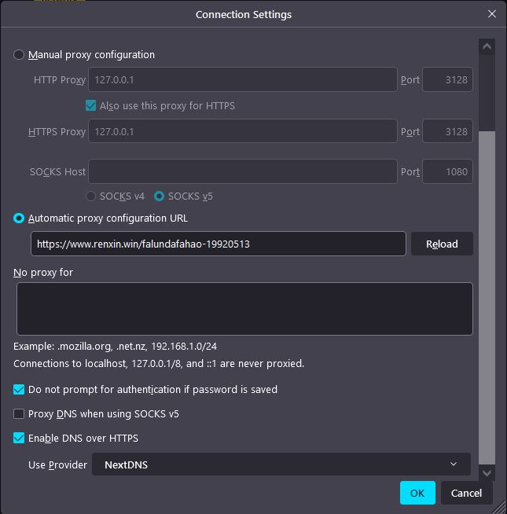

# resouces

pacproxy compiled executable programes and manuals

pac加密代理服务器，编译好的绿色可执行程序和说明文档

服务器软件在[pacproxy-server文件夹](pacproxy-server)

客户端软件wssagent在[wssproxy-agent文件夹](wssproxy-agent)


## 推荐

推荐用prcproxy安全的访问以下网站：
* 明慧网：https://www.minghui.org
* 干净世界：https://www.ganjing.com
* 神韵作品: https://shenyunzuopin.com
* 大法经书: https://www.falundafa.org


## pacproxy 服务器设置（参数示例）：

```
  paclink: '/pacurl_direct',

  iphours: 2,
  
  pacpass: [ '/pacurl_need_password', 'proxy_user', 'proxy_pass' ],
  
  domain: 'your.proxy.com',
```
服务器说明详见：https://github.com/httpgate/pacproxy-server


## 用pacurl翻墙：

运行服务器后，服务器会显示以下pacurl:

pacurl1 :  https://your.proxy.com/pacurl_direct         (超过两个小时不上网需要关闭和重新打开浏览器)

pacurl2 :  https://your.proxy.com/pacurl_need_password  (浏览器会提示输入用户密码）

   用户/密码：proxy_user / proxy_pass  （需要在2分钟内输入正确用户密码，否则需要关闭重新打开浏览器）


可以直接将pacurl设置在Firefox浏览器内，或wifi网络设置上，无需安装翻墙软件即可翻墙

pacurl翻墙说明详见： https://github.com/httpgate/pacproxy.js/blob/main/documents/DeviceSetting_ZH.md

Firefox设置：



主流浏览器都支持pacproxy, 其他软件很多只支持普通proxy, 可以用[Stunnel](https://www.stunnel.org/)或类似软件将pacproxy转为普通的内网proxy。

Stunnel的参考设置为：

```
foreground - yes

[example-proxy]
client = yes
accept = 127.0.0.1:8080
connect = your.proxy.com:443
```
pacurl1 需要改为：http://127.0.0.1:8080/pacurl_direct

pacurl2 需要改为：http://127.0.0.1:8080/pacurl_need_password

## 用websocket url (简称wssurl)翻墙：

运行服务器后，服务器还会显示以下wssurl:

直连websocket url1:  wss://your.proxy.com/pacurl_direct   （用于全局代理，可让聊天软件等翻墙)

直连websocket url2:  wss://your.proxy.com/pacurl_direct/tls  （用于域名伪装时的tls验证)


需要在命令行运行wssagent软件，示例： ./wssagent-linux  wss://your.proxy.com/pacurl_direct/tls  3128

翻墙说明详见：https://github.com/httpgate/wssproxy-agent

Firefox设置见上图，选中Manual proxy configuration


## 用支持websocket的CDN中转翻墙

可以在类似cloudflare的支持websocket的CDN创建一个域名，如cdn.proxy.com，并将域名指向代理服务器的IP地址

CDN中转 websocke url1:   wss://cdn.proxy.com/pacurl_direct   （CDN能知道部分传输内容）

CDN中转 websocke url2:   wss://cdn.proxy.com/pacurl_direct/tls   (传输内容对CDN加密)


需要在命令行运行wssagent软件，示例： ./wssagent-linux  wss://cdn.proxy.com/pacurl_direct/tls  3128

CDN中转翻墙说明详见：https://github.com/httpgate/wssproxy-agent

Firefox设置见上图，选中Manual proxy configuration


## 建立镜像服务器

如果pacurl被封锁，而wssurl可连通，可以用wssurl + /pac, 运行wssagent软件在国内建立镜像服务

用直连wssurl:    wss://your.proxy.com/pacurl_direct/pac

用CDN中转wssurl: wss://cdn.proxy.com/pacurl_direct/pac


需要在命令行运行wssagent软件，示例： ./wssagent-linux  wss://cdn.proxy.com/pacurl_direct/pac  443  -s

wssurl + /pac翻墙说明详见：https://github.com/httpgate/wssproxy-agent

Firefox设置同2 用pacurl翻墙，但只能用需要输入户名密码的pacurl_need_password

可能需要用类似nextdns.io这样的Private DNS加密DNS服务，可参考[CDN中转DOH服务](https://github.com/httpgate/wssproxy-agent/blob/main/CDN_PROXY_DOH.md)


## 测试

简单验证：https://whatismyipaddress.com/   检查是否是自己的公网IP

性能测试：干净世界 https://www.ganjing.com/ 等视频网站

注意：刚访问一个新网站时会慢一会，打开后就就很快了，https握手时慢